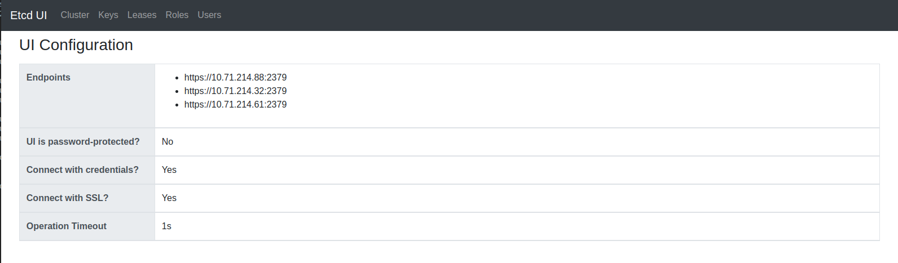
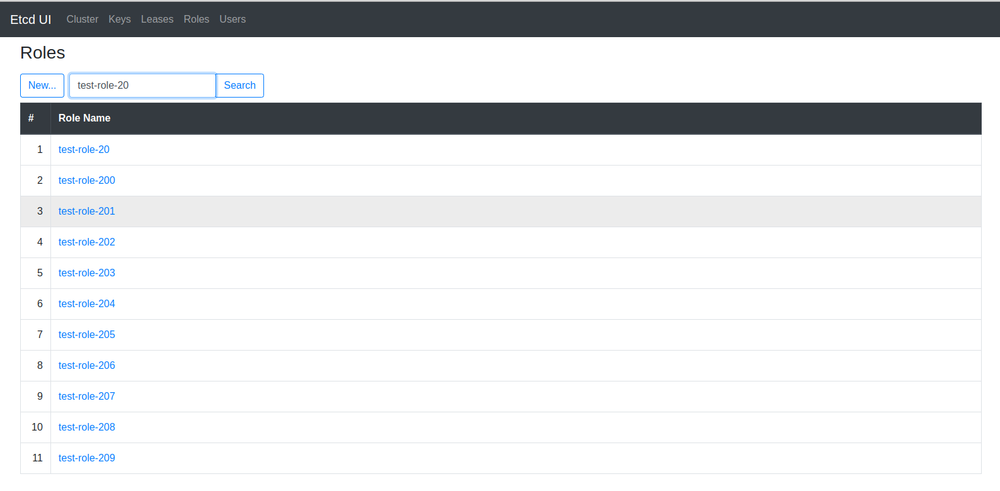
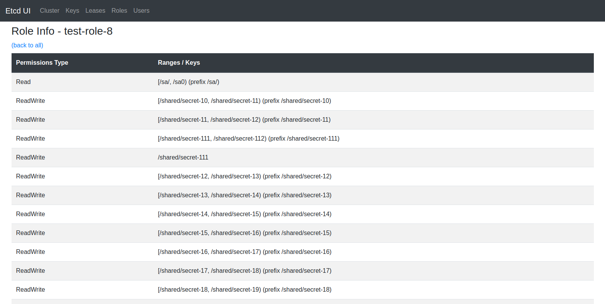
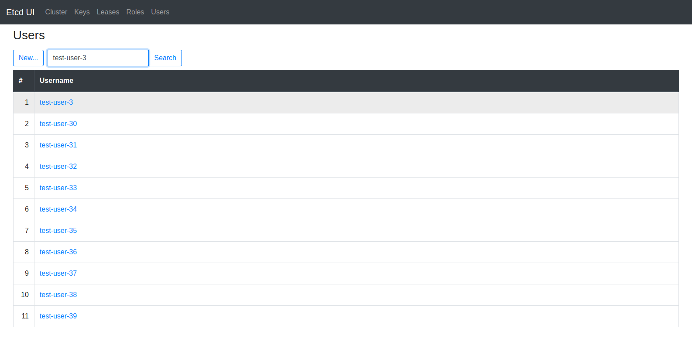
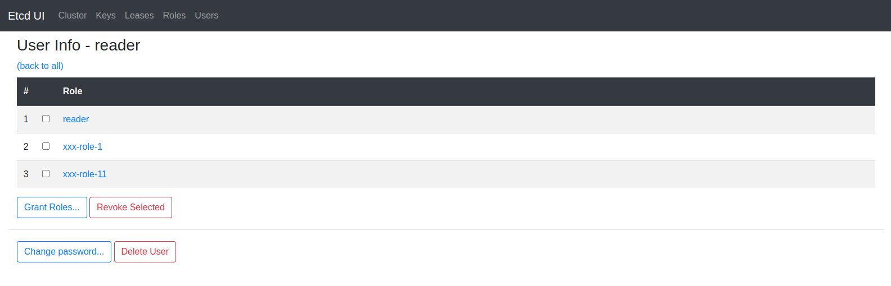

# etcd-ui

A simple UI for Etcd clusters. Tested with Etcd API v3 only.

## Features

- [x] Show cluster stats with cluster members and their status
- [x] Allow moving the leader from the UI
- [x] Show users list and user detail
- [x] Show roles list and role detail
- [x] Show keys list and key detail
- [x] Allow paswordless and password-protected setup (with BasicAuth)
- [x] Allow getting and setting KV pairs
- [x] Allow creating/modifying leases
- [x] Allow creating/modifying roles
- [x] Allow creating/modifying users
- [ ] Allow enabling/disabling auth

## Configuration

_See `.env.example` for variable names. The names should be sufficient to understand the purpose._

### Endpoints

To connect to an Etcd cluster, you need to set endpoints in `ETCD_NODES`. It should be a comma-separated list of Peer URLs (with ports). For example, ETCD_NODES="http://10.71.214.88:2380,http://10.71.214.32:2380,http://10.71.214.61:2380"

### Operation timeout

To limit operational times to acceptable levels, the application uses `ETCD_TIMEOUT` (5s by default), in seconds, which you can configure. Minimum timeout is 1s.

### BasicAuth protection

You can set up a BasicAuth that will add some protection.

### Etcd with auth enabled

If you have Etcd with auth enabled, you need to set the `ETCD_ADMIN_USER` and `ETCD_ADMIN_PASSWORD` variables. If you use a non-root level user for it, some UI functions can result with errors. Make sure to set these to empty if Etcd auth is disabled. Otherwise, you will see warnings "authentication is not enabled" in the logs.

If your cluster runs with TLS, you can set `SSL_KEY`, `SSL_CERT`, and `SSL_CA` (SSL_CA can be empty; if non-empty, it must be valid). If the TLS files are valid, the username and password will be set to empty automatically.

## Run in Docker

You can build a Docker image to run the application in Docker. To build an image, run

```bash
docker build -t etcd-ui:local -f infra/docker/Dockerfile .
```

The image exposes port 8080/tcp. To run the application locally in Docker, you can use the following command line. We assume you created a valid `.env` and SSL certificates (if you are using Etcd with TLS enabled)

```bash
docker run -it --rm -p 8080:8080 -v $(pwd)/.env:/app/.env -v $(pwd)/ssl:/app/ssl etcd-ui:local
```

## Screenshots








